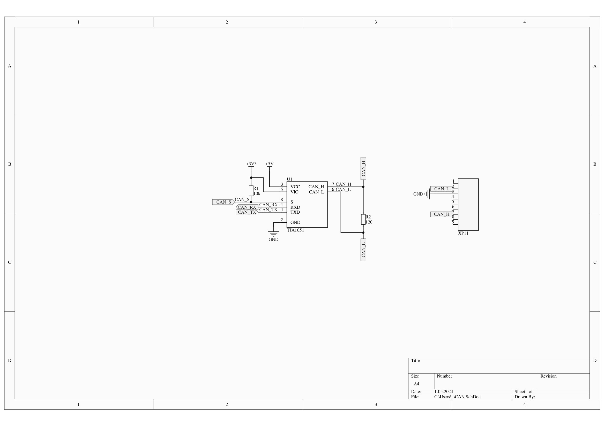
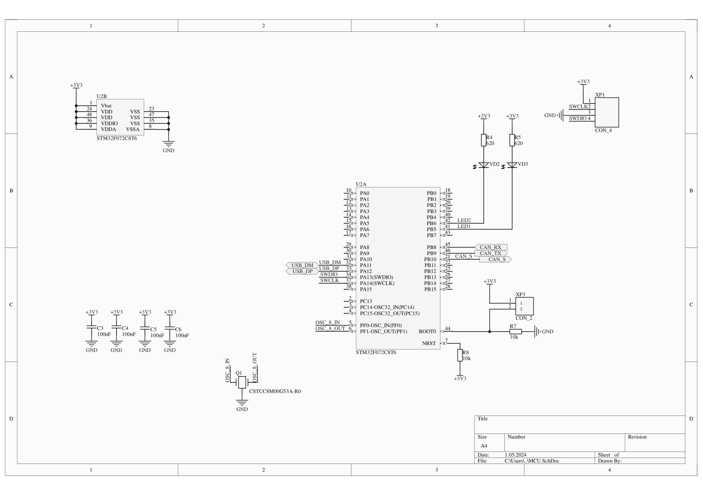
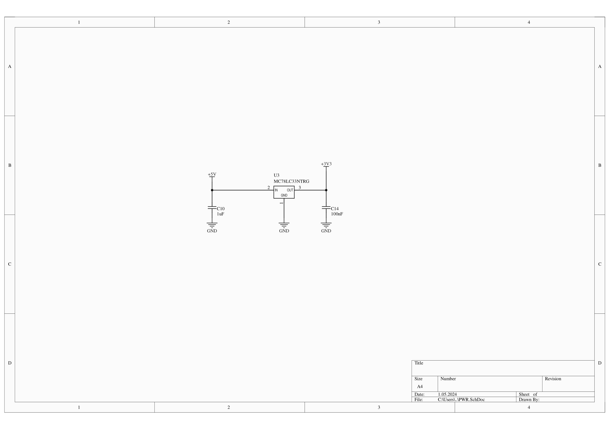
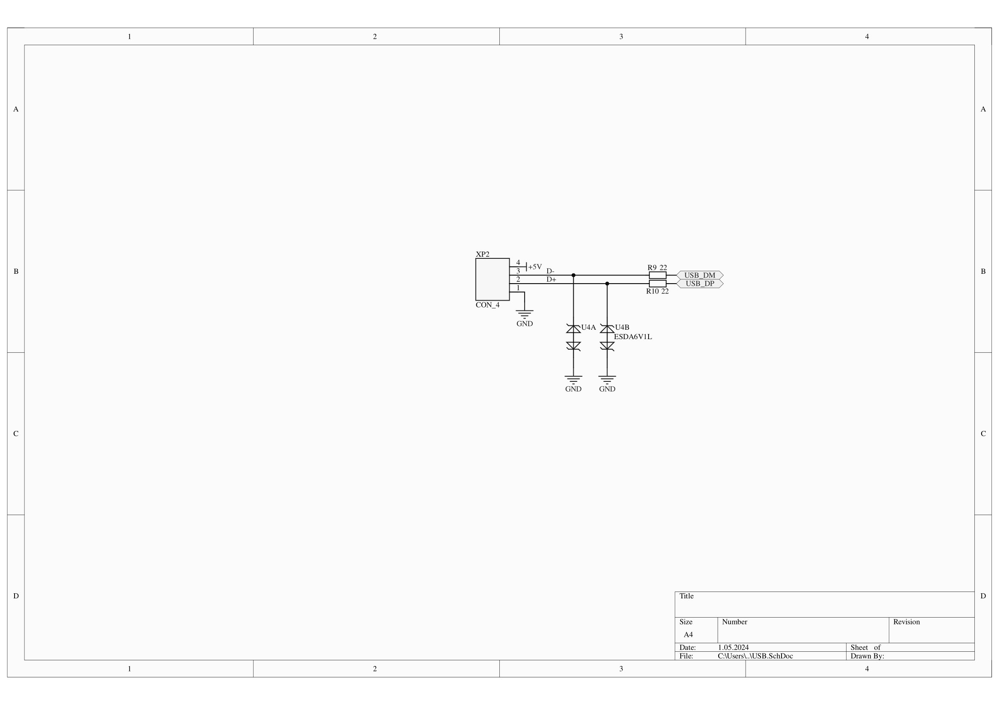
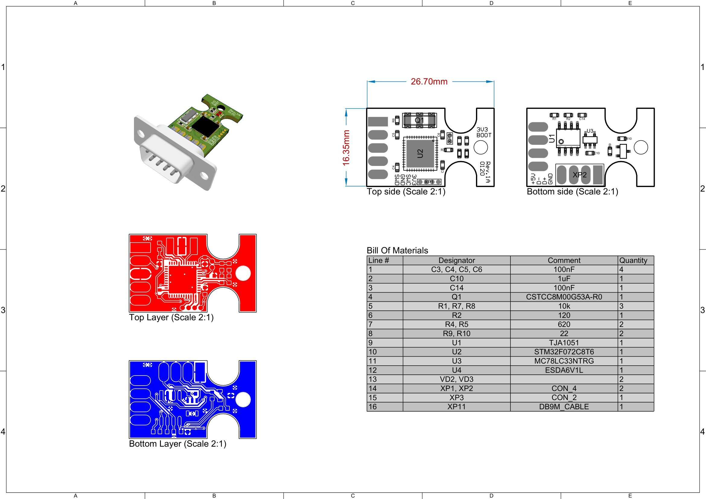
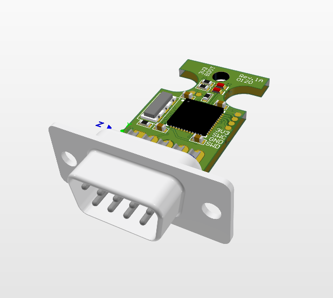
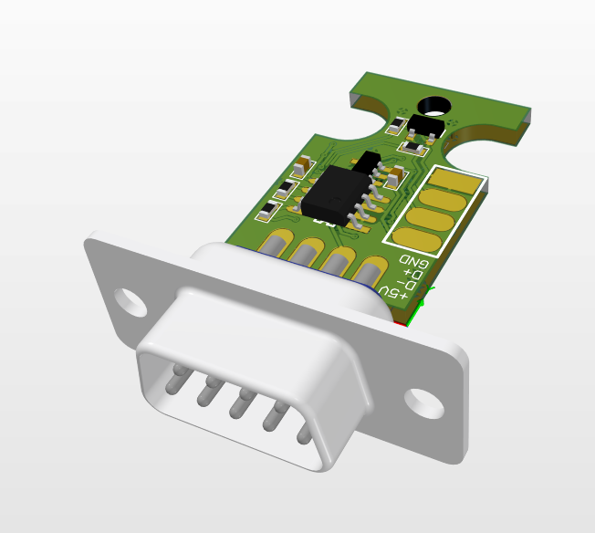

# About
A micro-verison of [USB-to-CAN](https://github.com/romdnop/can_usb) converter based on STM32F072 MCU.\
It is recomended to open the project in _Altium Designer v20.2.7_ but earlier versions can also be suitable.

# Schematics

# PCB

# 3D view

